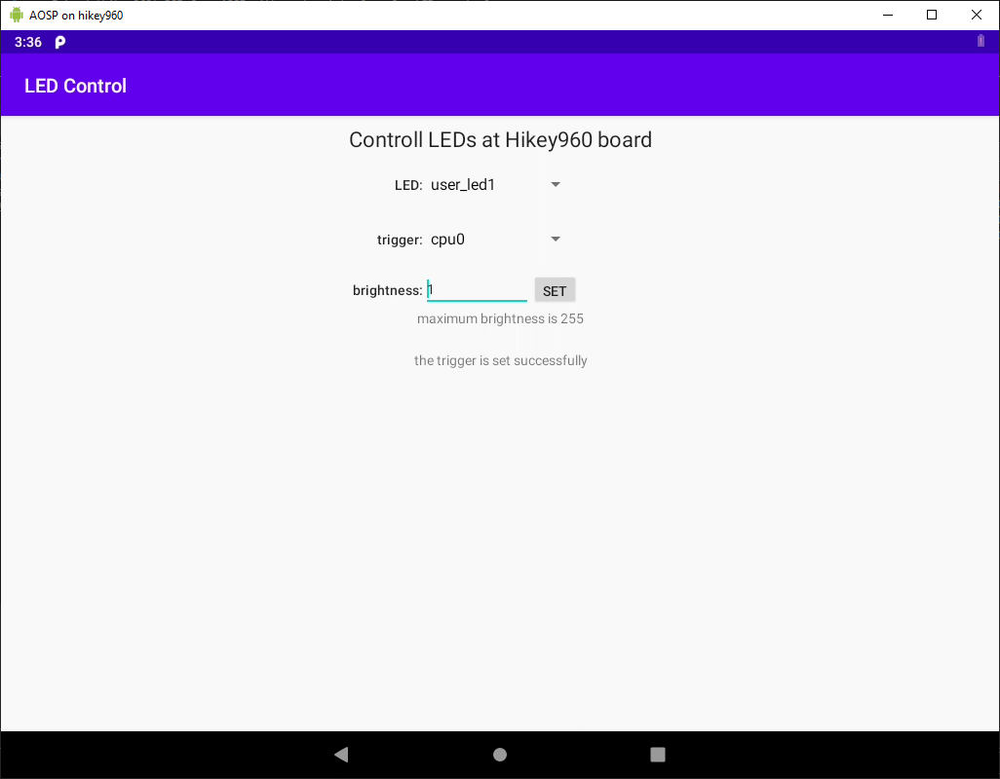
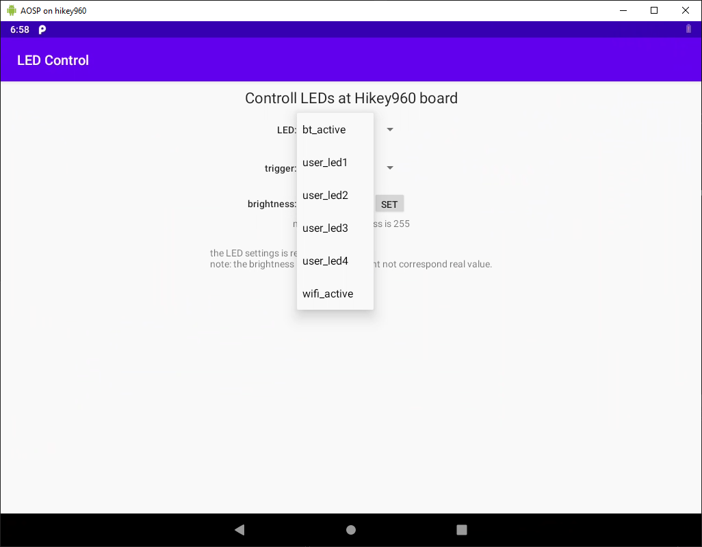
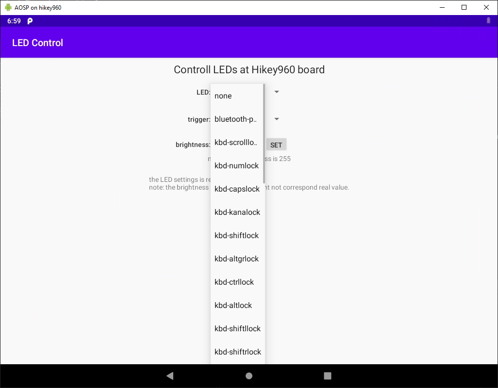

# hikey-linaro-led
Android application for control LEDs on linaro hikey960 board.
The project consists of:
- [java-application](apps/com.gl.ledcontrolapp);
- [jave-service](apps/com.gl.ledcontrolservice);
- [C++ Android HAL-daemon](hardware/interfaces/led);

## Possibilities of the application:
- Show list of all LEDs in the system;
- For any chosen LED:
  - Show selected trigger and all possible triggers;
  - Show maximum of brightness;
  - Show current brightness (at the moment of reading);
  - Changing trigger for the LED;
  - Changing brightness of the LED.

All changed settings are kept until system restart.

## HAL-daemon description:
The daemon is starts with the system and controls LED through the /sys - files.
For safety reason, identification of LED is realized not by string but by LED-number. Enumerating of the LEDs is made at the start of the daemon and application should provide the number of the LED on any LED operation except getting list of the LEDs.
After any writing to a file the daemon reads the file and returns the read value as a string.

## Screenshots:

